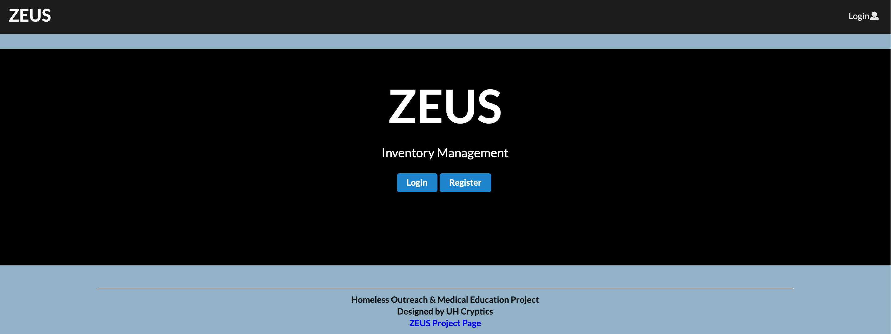
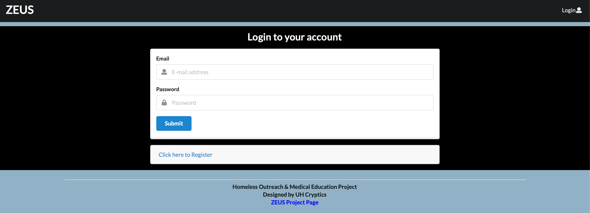
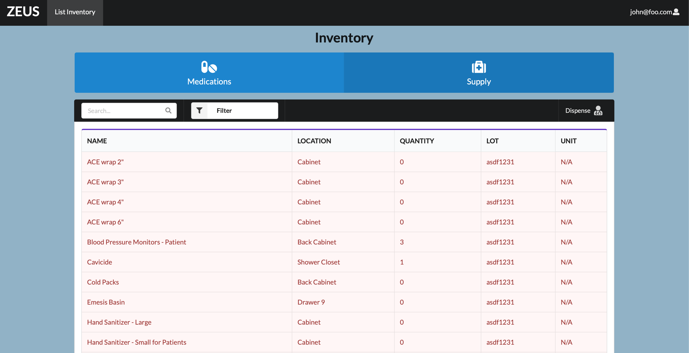
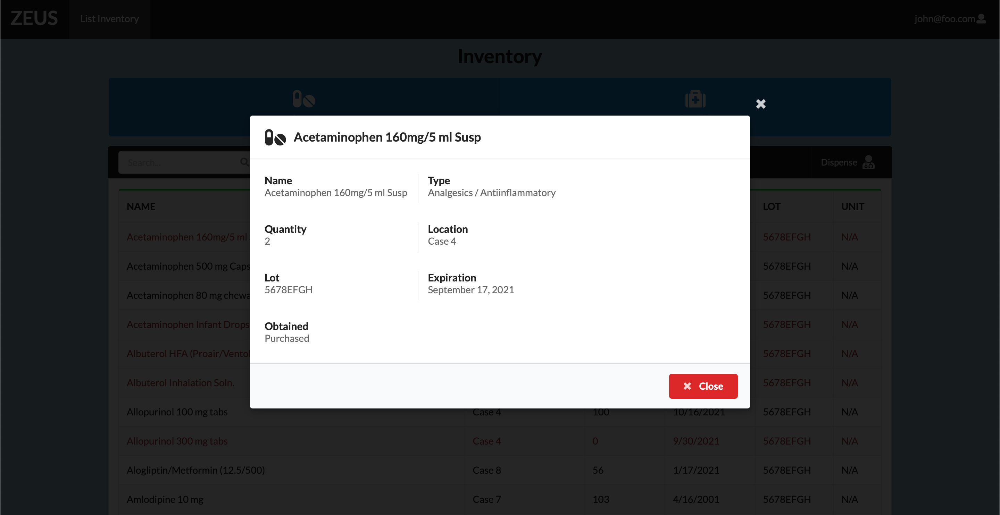
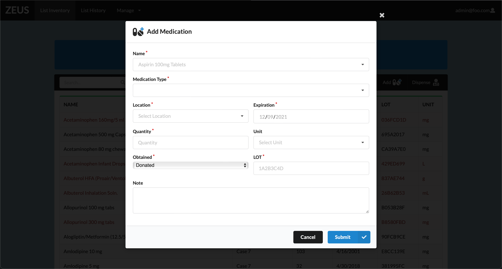
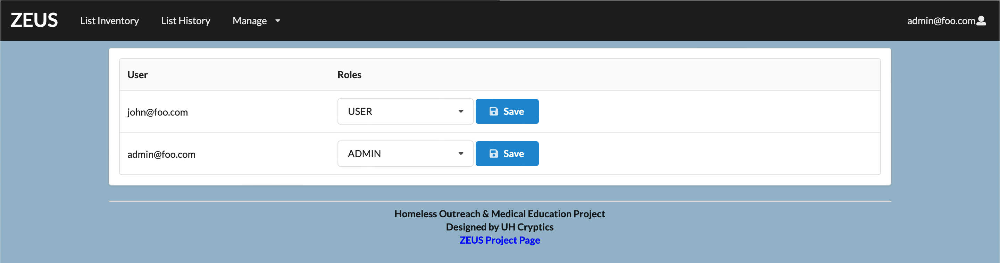

# UH Cryptics

## Table of contents

* [Overview](#overview)
* [Deployment](#deployment)
* [User Guide](#user-guide)
* [Development History](#development-history)
* [Team](#team)


## Overview

Hello and welcome to ZEUS! Our project is oriented around creating an online application to help manage the inventory of medical supplies for clinics in Hawai'i. We want to create a simple and easy to use interface so that anyone is capable of using our application.

## Deployment

A live deployment of Zeus is available at [https://zeus.uhcryptics.xyz/](https://zeus.uhcryptics.xyz/).

## User Guide

This project is still in the early stages of development. Below are the page mockups of the components we wish to implement in our finished product.

### Landing Page

The landing page is presented to users when they visit the top-level URL to the site. You can either choose to login to an existing account or register a new one. 



### Login and Register

Click on the "Login" button in the middle of the screen, then type in your username and password on the following page to login. You must have been previously registered with the system to use this option:



Alternatively, you can select "Register" to go to the following page and register as a new user:


### User Home page

After logging in, you are taken to the home page, which presents the welcome message and guidelines what you can see and do.




### Inventory Information

Users can view the inventory information of each medication or supply.



### Searching

You are able to search for items by the name of the medications and supplies. You can also filter search by low inventory, name, location, quantity, and LOT number.


### Dispense page

Users can dispense medication or supplies.

 

### Admin page


### Edit/Delete Medication

Admin users can edit or delete the inventory information for medication and supplies.


### Add Medication & Supply

This is where you can add a medication or supply to the inventory.

 

### Dispense History Page

History log of medication and or supplies that were dispensed to patients.

### Manage Users

Admin users can view and manage current users in the database, such as changing their roles if needed.




## Developer Guide

This section provides information of interest to Meteor developers wishing to use this code base as a basis for their own development tasks.

### Installation

First, [install Meteor](https://www.meteor.com/install).

Second, visit the [UH Cryptics application github page](https://github.com/uh-cryptics/zeus), and click the "Use this template" button to create your own repository initialized with a copy of this application. Alternatively, you can download the sources as a zip file or make a fork of the repo.  However you do it, download a copy of the repo to your local computer.

Third, cd into the zeus/app directory and install libraries with:

```
$ meteor npm install
```

Fourth, run the system with:

```
$ meteor npm run start
```

If all goes well, the application will appear at [http://localhost:3000](http://localhost:3000).

### Application Design

UH Cryptics is based upon [meteor-application-template-react](https://ics-software-engineering.github.io/meteor-application-template-react/) and [meteor-example-form-react](https://ics-software-engineering.github.io/meteor-example-form-react/). Please use the videos and documentation at those sites to better acquaint yourself with the basic application design and form processing in UH Cryptics.

## Initialization
To do

#### End to End Testing

UH Cryptics uses [TestCafe](https://devexpress.github.io/testcafe/) to provide automated end-to-end testing.

To do

## From mockup to production

UH Cryptics is meant to illustrate the use of Meteor for developing an initial proof-of-concept prototype.  For a production application, several additional security-related changes must be implemented:

* Use of email-based password specification for users, and/or use of an alternative authentication mechanism.
* Use of https so that passwords are sent in encrypted format.
* Removal of the insecure package, and the addition of Meteor Methods to replace client-side DB updates.

## Continuous Integration
To Do

## Development History

The development process for UH Cryptics conformed to [Issue Driven Project Management](http://courses.ics.hawaii.edu/ics314f19/modules/project-management/) practices. In a nutshell:

* Development consists of a sequence of Milestones.
* Each Milestone is specified as a set of tasks.
* Each task is described using a GitHub Issue, and is assigned to a single developer to complete.
* Tasks should typically consist of work that can be completed in 2-4 days.
* The work for each task is accomplished with a git branch named "issue-XX", where XX is replaced by the issue number.
* When a task is complete, its corresponding issue is closed and its corresponding git branch is merged into master.
* The state (todo, in progress, complete) of each task for a milestone is managed using a GitHub Project Board.

The following sections document the development history of UH Cryptics.

### Milestone 1: Mockup development
The goal of Milestone 1 was to create mockup pages for the inventory management page in the system.

Milestone 1 was managed using ZEUS Github Project Board M1:


### Milestone 2: Data model development
The goal of Milestone 2 was to implement functionality for each mockup page created from Milestone 1.

Milestone 2 was managed using ZEUS Github Project Board M2:


### Milestone 3: Fixes
The goal of Milestone 3 was to continue implementing functionality to our website and UI.

Milestone 3 was managed using ZEUS Github Project Board M3:


### Milestone 4:
The goal of Milestone 4 was creating history pages for Admin users and UI.

Milestone 4 was managed using ZEUS Github Project Board M4:


### Milestone 5: Deployment
The goal of Milestone 5 was deploying our website to Digital Ocean with its own domain name. Also, we were able to implement a QR code API.


### Milestone 6:
In progress...

## Team

[Chase](https://github.com/Chase-Lee-ui) /
[Cheolhoon](https://github.com/cheolhoon) /
[Daniel](https://github.com/dflorenco1) /
[Deshay](https://github.com/deshay-clemons) /
[Jessica](https://github.com/jktang342) /
[Luke](https://github.com/lukemcd9) /
[Rafael](https://github.com/rabitz808) /
[Sheena](https://github.com/sheenatorres) /

UH Cryptics is designed, implemented, and maintained by [UH Cryptics Organization](https://github.com/uh-cryptics/).
